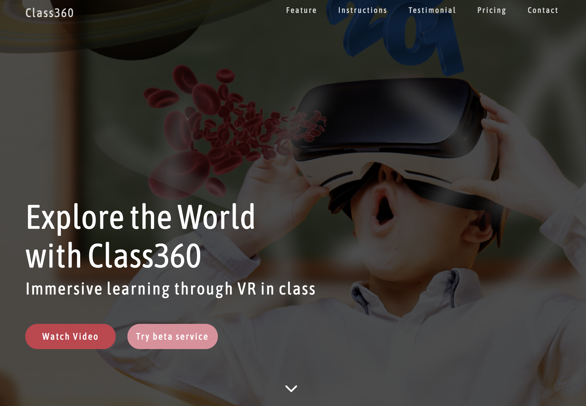

# Class360

Class360 is a virtual reality tech startup based in Haifa, Israel.

Class360 offers high quality and easy-to-configure Virtual Reality Device and subscription to vast educational content for kids from range of elementary schooler to higher education institute.

Check out class360 introductory youtube video/ device instruction/ subscription plan by clicking -> [here](http://class360vr.surge.sh/)
